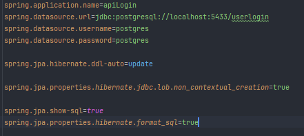
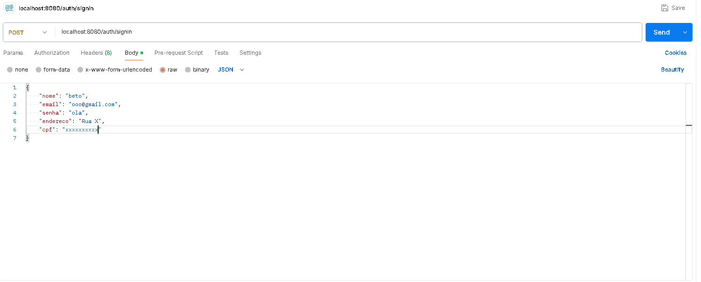
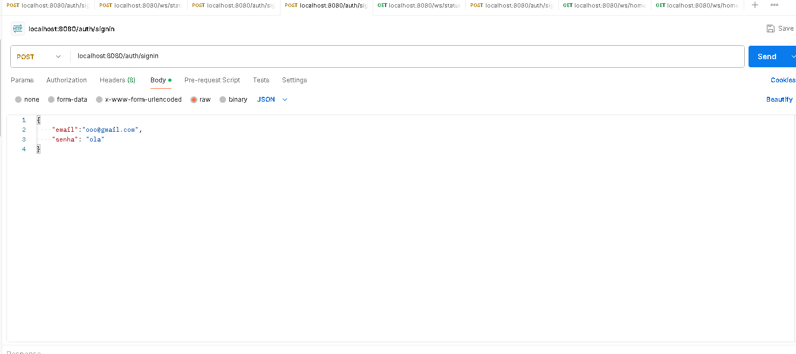
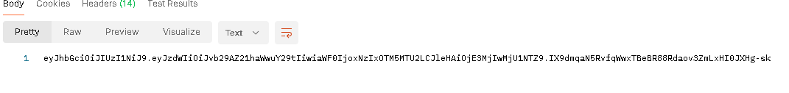
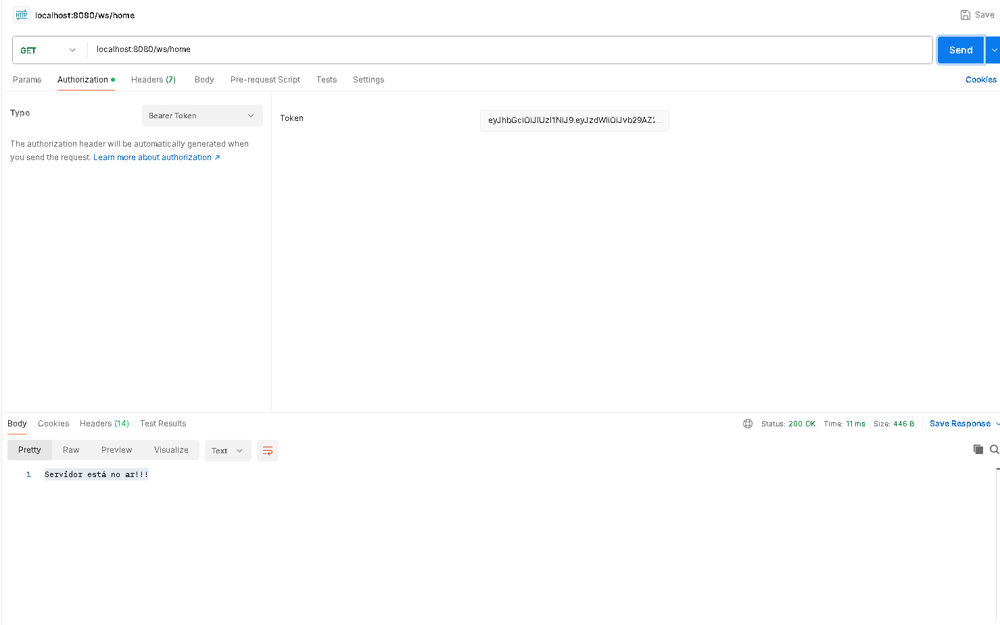

# Login API JWT

## Como configurar

#### 1º - Adicione o link do deploy do seu banco de dados em spring.datasource.url
#### 2º - Coloque seu username/passowrd do banco de dados em spring.datasource.username/password
###### Observação: os comandos abaixo geram automaticamente o banco de dados da API. Caso deseje utilizar seu próprio banco de dados, deve remover esses comandos e linkar direto ao criado manualmente.

## Como utilizar

### ROTAS:
###### Rota de Cadastro
#### [seulink]/auth/signup
###### Rota de Login
#### [seulink]/auth/signin
###### Rota home (Essa rota para acessar necessita do token gerado durante o login para continuar)
#### [seulink]/auth/ws/home

## Realizar teste

### POSTMAN (metodo POST) /SIGNUP
###### CPF E EMAIL DEVEM SER VÁLIDOS

### POSTMAN (metodo POST) /SIGNIN

###### TOKEN RETORNADO

### POSTMAN (metodo GET) /HOME

###### O método deve conter o token gerado inserido manualmente no POSTMAN em Authorization.
"# CuraBackEnd" 
